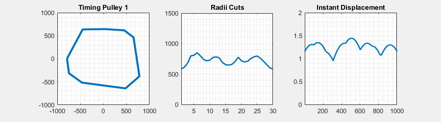

# Data-Pulley-Nozzle

## This work was done in collaboration with Bandar AlBraheem.

This repository contains the simulation of 'instant displacement' for 10000 different timing pulleys (for the mathematical model, please refer to: https://ieeexplore.ieee.org/document/9867553).

Essentially, for each pulley, we draw 15 lines, each passing through the center of rotation, and we store the 30 contact points of the lines with the perimeter of the pulley. The distance between the center of rotation and the contact points is the first dataset.

Files 'pulleys' and 'pulley_circles' each contain 5000 pulleys with sharp edges and round edges, respectively.
For the pulleys with sharp edges: the folder 'pulleys_data' contains datasets with the radii (pulleys_radii.csv) and du/dw (pulleys_matrices.csv).
For the pulleys with round edges: the folder 'pulley_circles_data' contains datasets with the radii (pulley_circles_radii.csv) and du/dw (pulley_circles_matrices.csv).
